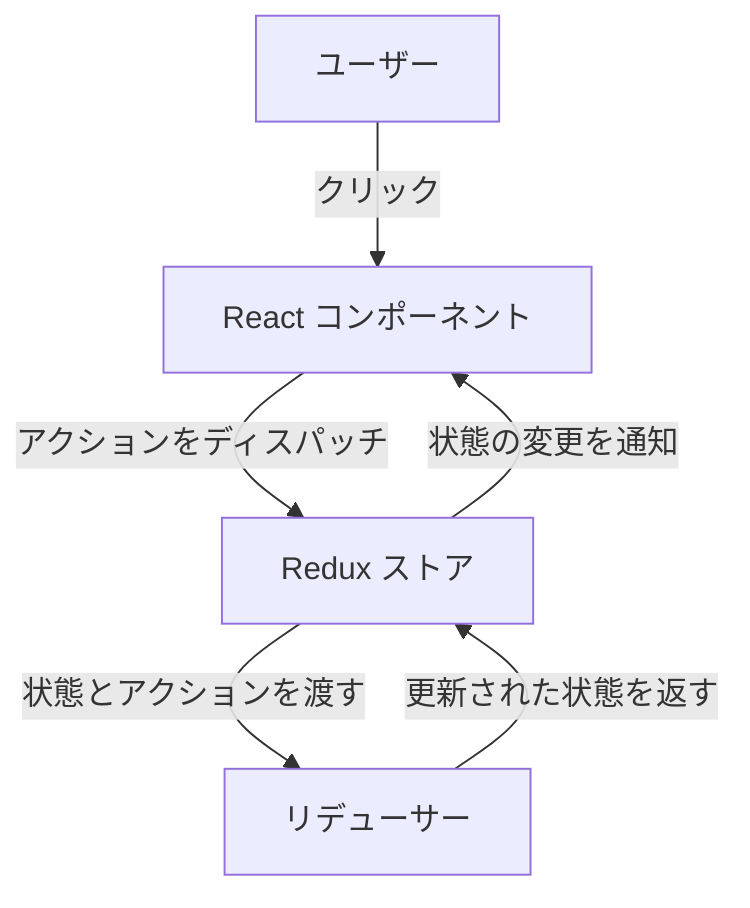

# Redux Counter Application

シンプルなカウンターアプリケーションを作成して、Redux を使った状態管理を学びます。このプロジェクトでは、Redux を使用して React アプリケーション内での状態管理の基礎を学びます。

---

## 目次
1. [プロジェクト概要](#プロジェクト概要)
2. [特徴](#特徴)
3. [学べる内容](#学べる内容)
4. [前提条件](#前提条件)
5. [インストール手順](#インストール手順)
6. [使い方](#使い方)
7. [ファイル構成](#ファイル構成)
8. [使用技術](#使用技術)
9. [貢献方法](#貢献方法)
10. [ライセンス](#ライセンス)

---

## プロジェクト概要

このプロジェクトは、画面に表示されるカウンターの値を増加および減少させるシンプルなアプリケーションです。アプリケーションは **Redux** を使用して状態を集中管理し、予測可能な状態管理を実現します。

---

## 特徴

- ボタンクリックでカウンターを増加させる。
- ボタンクリックでカウンターを減少させる。
- Redux を使用した集中状態管理。
- アクション、リデューサー、ストアの分離による明確な設計。

---

## 学べる内容

このプロジェクトを通じて以下を学べます：

- **Redux の基礎**: アクション、リデューサー、ストアといった基本概念の理解。
- **React-Redux の統合**: `useSelector` と `useDispatch` を使用して React コンポーネントと Redux ストアを接続。
- **状態管理のベストプラクティス**: アプリケーション状態を集中管理して、予測可能でデバッグ可能な設計を学ぶ。
- **ファイル構成**: アクション、リデューサー、コンポーネントを分離して整理する方法。
- **Flux アーキテクチャ**: Redux が実現する一方向データフローの理解。
- **イミュータビリティ**: Redux のリデューサーパターンを使用して状態を不変に保つ方法。

### 概念図（Mermaid 記法）


---

## 前提条件

以下がインストールされている必要があります：

- **Node.js** (推奨バージョン: 14 以上)
- **npm** (推奨バージョン: 6 以上)
- React プロジェクトがセットアップ済み（例: `npx create-react-app my-app` を使用）。

---

## インストール手順

1. このリポジトリをクローン：
   ```bash
   git clone <repository-url>
   cd <repository-folder>
   ```

2. 依存関係をインストール：
   ```bash
   npm install
   ```

3. 開発サーバーを起動：
   ```bash
   npm start
   ```

---

## 使い方

1. ブラウザで `http://localhost:3000` を開きます。
2. **Increment** ボタンをクリックしてカウントを増加させます。
3. **Decrement** ボタンをクリックしてカウントを減少させます。

---

## ファイル構成

```
my-app/
│
├── src/
│   ├── actions/
│   │   └── actions.js            # アクションタイプとアクションクリエータ
│   │
│   ├── reducers/
│   │   └── index.js              # リデューサーロジック
│   │
│   ├── store.js                  # Redux ストアの設定
│   │
│   ├── components/
│   │   └── CounterComponent.js   # カウンター UI コンポーネント
│   │
│   └── App.js                    # アプリケーションのメインコンポーネント
│
├── diagrams/                     # UML 図
│   ├── arch.pu                   # アーキテクチャ図
│   ├── usecase.pu                # ユースケース図
│   └── activity.pu               # アクティビティ図
│
├── Dockerfile                    # Docker 設定
├── docker-compose.yml            # Docker Compose 設定
├── requirement/requirements.md   # 詳細な要件
└── README.md                     # プロジェクトドキュメント
```

---

## 使用技術

- **React**: ユーザーインターフェースを構築。
- **Redux**: 状態管理の集中化。
- **React-Redux**: Redux を React コンポーネントと統合。
- **Docker**: コンテナ化されたデプロイメント（オプション）。

---

## 貢献方法

貢献は歓迎します！以下の手順に従ってください：

1. このリポジトリをフォーク。
2. 新しいブランチを作成：
   ```bash
   git checkout -b feature-name
   ```
3. 変更をコミット：
   ```bash
   git commit -m "Add feature-name"
   ```
4. ブランチをプッシュ：
   ```bash
   git push origin feature-name
   ```
5. プルリクエストを送信。

---

## ライセンス

このプロジェクトは MIT ライセンスのもとで提供されています。詳細は `LICENSE` ファイルを参照してください。

