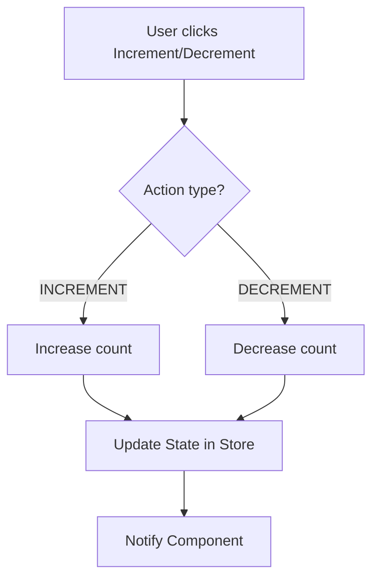
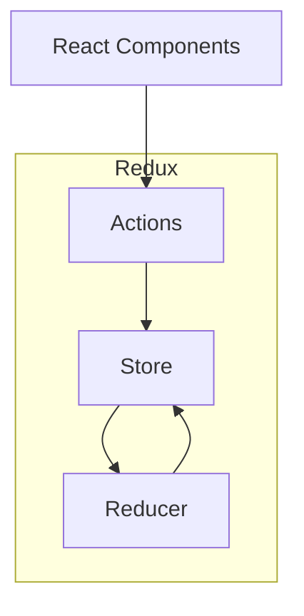
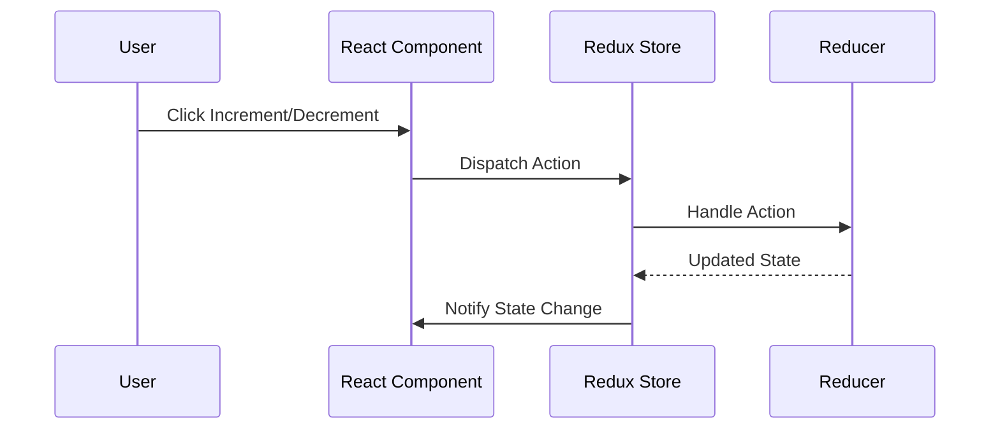
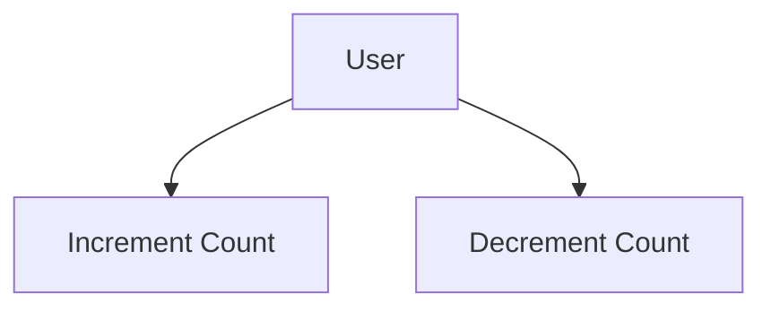

# アクティビティ図

```mermaid
graph TD
  A[User clicks Increment/Decrement] --> B{Action type?}
  B -->|INCREMENT| C[Increase count]
  B -->|DECREMENT| D[Decrease count]
  C --> E[Update State in Store]
  D --> E[Update State in Store]
  E --> F[Notify Component]
```
# コンポーネント図

```mermaid
graph TD
  subgraph Redux
    A[Actions]
    B[Reducer]
    C[Store]
  end

  D[React Components] --> A
  A --> C
  C --> B
  B --> C
```
# シーケンス図

```mermaid
sequenceDiagram
  participant User
  participant RC as React Component
  participant RS as Redux Store
  participant R as Reducer

  User ->> RC: Click Increment/Decrement
  RC ->> RS: Dispatch Action
  RS ->> R: Handle Action
  R -->> RS: Updated State
  RS ->> RC: Notify State Change
```
# ユースケース図

```mermaid
graph TD
  actor[User]
  UC1[Increment Count]
  UC2[Decrement Count]

  actor --> UC1
  actor --> UC2
```